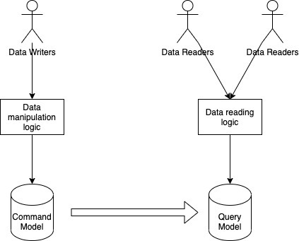
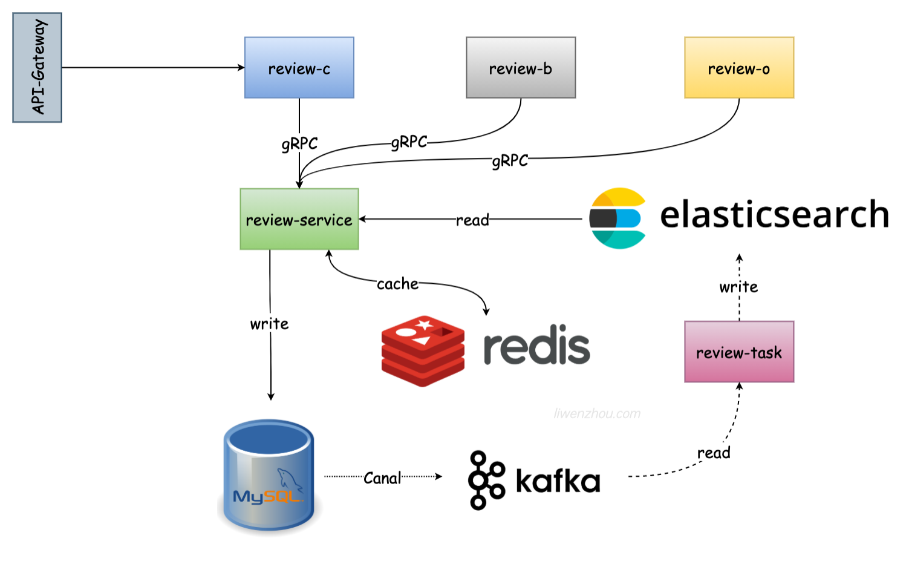

# 项目背景

⽬前市⾯上有⽐较多业务场景需要⽤到评价/评论系统，不同业务形态下对评价/评论系统的要求不尽相同。

站在开发者⻆度，从电商类评价系统和UGC社区评论系统两者中总结出共性，设计出⼀套具有普适性的技术⽅案。
以实现⼀套电商评价服务为主。

总体作为⼀个相对⽐较通⽤的微服务项⽬，在公司内部通常作为中台服务，独⽴开发、独⽴部署。在公司内部通过RPC⽅式与业务⽅对接。

# 整体架构

- C端：⽤户端，包括发评⽤户和看评⽤户。
- B端：商家端，店铺商家端，店铺管理者，商品发布者。
- O端：运营端，运营同学在运营后台负责审核⽤户评价，处理商家申诉，以及基于评价进⾏运营活动。

整体采用CQRS架构模式实现项目中读、写操作采⽤不同的存储模型：

具体架构：

涉及技术栈：

Kratos + gRPC + Consul + GORM + Gen + MySQL + Redis + Canal + Kafka + Elasticsearch

# 项目代码管理

采用 multi-repo + git submodule子模块

将通用的protobuf文件及生成代码存放至子模块，保证各微服务使用的proto文件相同且版本相同

- B端：https://github.com/wshaoYa/review-B
- O端：https://github.com/wshaoYa/review-o
- job流式服务：https://github.com/wshaoYa/review-job
- api子模块：https://github.com/wshaoYa/review-apis

# 主要业务开发模块

**评价服务C端（review-c）**
1. 发表评价
2. 查看评价
3. 查看⾃⼰的全部评价

**评价B端（review-b）**
1. 店铺评价列表
2. 店铺评价详情
3. 回复评价
4. 申诉评价

**评价O端（review-o）**
1. 评价列表（筛选）
2. 评价详情
3. 审核评价
4. 审核申诉

**关键点**
* 雪花算法⽣成ID
* validate参数校验
* GORM事务操作
* 接⼝幂等
* 接⼝防⽌⽔平越权
* 缓存
  * 查询ES时使⽤filter，使得ES使⽤缓存。
  * 在ES前增加⼀层Redis缓存
  * 通过 singleflight 在语⾔层⾯合并多次并发的查询ES的请求，将ES的返回结果缓存到Redis中。
  * 针对这个评价服务⽽⾔，其对数据⼀致性要求没有那么⾼，缓存直接查询完更新即可

# 主要收获

1. 了解了⼤型中台项⽬的架构设计。
2. 锻炼了⾃⼰使⽤常⽤中间件解决业务问题的能⼒。
3. 对微服务的理解更深刻了。
4. 对kratos框架及组件更熟悉了。